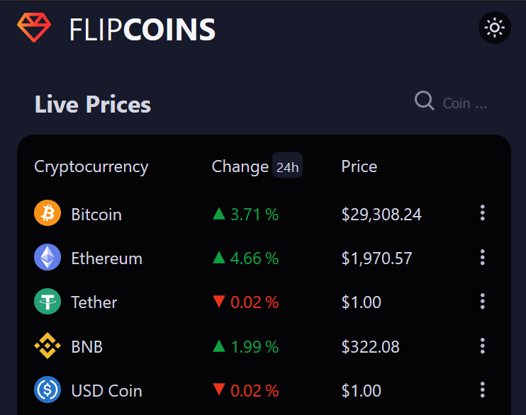

## Hi, I'm Babbili 

I'm a DevOps Engineer and a Certified Kubernetes Administrator, helping businesses implementing DevOps & Site Reliability Engineering, Kubernetes hybrid setup (on-prem + cloud), Kubernetes security & compliance, migrating applications to the cloud, applications' monitoring & observability

📫 How to reach me! 

### DevOps & Cloud

')

 

### Tech Tools

 

 
 
 
 

<!-- ## Projects

- ### [giftandmore.shop](https://giftandmore.shop)
  <small>https://giftandmore.shop</small> 

> Node Js MVC pattern ecommerce Webapp  
> GCP Containerized Compute Engine VM with Cloud Build ci/cd  
> NGINX server with Cyber security configuration  <small> *XSS attacks prevntion, Content Security Policy*</small> 
> PayPal server-side integration 
> Pleasant mobile responsive UX/UI, animation on scroll 
> SEO through code, ld+JSON schema.org markups

- ### [FLIPCOINS](https://flipcoins.vercel.app/) 
  <small>https://flipcoins.vercel.app</small> 

>Next Js Hybrid webapp: Server Side Rendering & Static Site Generation 
>Dynamic Routing 
>3D transform-style animated logo 
>a native like experience on mobile

- ### [VR Blog](https://vr-blog.vercel.app/) 
  <small>https://vr-blog.vercel.app</small> 

Check for more in my code repositories
  -->